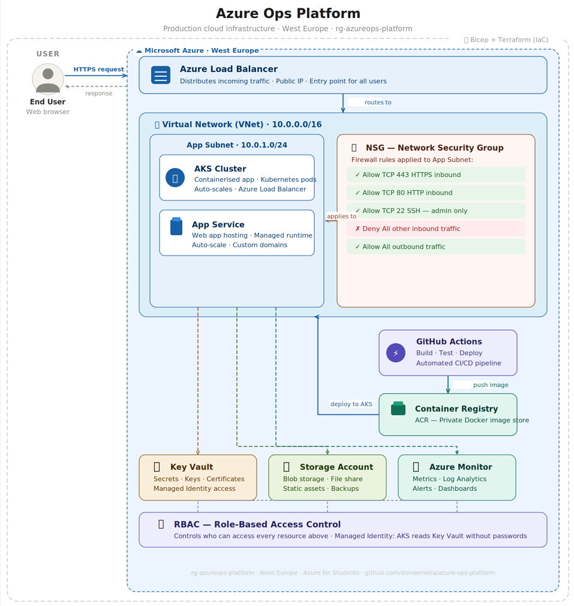

# azure-ops-platform
Production-style Azure infrastructure covering networking, compute, storage, AKS, CI/CD, monitoring and security

## 🏗️ Project Architecture

## 📋 Modules

| Module | Topic | Status |
|--------|-------|--------|
| 0 | Big Picture + Setup | ✅ Complete |
| 1 | Portal + CLI + Resource Group | ✅ Complete |
| 2 | Networking — VNet, Subnet, NSG | 🔄 In Progress |
| 3 | Compute — Virtual Machine | ⏳ Pending |
| 4 | Storage — Blob Storage | ⏳ Pending |
| 5 | Identity — RBAC + Managed Identity | ⏳ Pending |
| 6 | Security — Key Vault | ⏳ Pending |
| 7 | Containers — ACR + AKS | ⏳ Pending |
| 8 | IaC — Bicep Templates | ⏳ Pending |
| 9 | CI/CD — GitHub Actions | ⏳ Pending |
| 10 | Monitoring — Azure Monitor | ⏳ Pending |

## 🛠️ Tech Stack

- **Cloud:** Microsoft Azure
- **IaC:** Bicep, Terraform
- **Containers:** Docker, AKS, ACR
- **CI/CD:** GitHub Actions
- **Monitoring:** Azure Monitor, Log Analytics
- **Security:** Azure Key Vault, RBAC
- **CLI:** Azure CLI, kubectl

## 📦 Azure Resources

- Resource Group: `rg-azureops-platform`
- Region: West Europe
- Subscription: Azure for Students

## 👤 Author

**Donatus Emeka Anyalebechi**
- GitHub: [github.com/donaemeka](https://github.com/donaemeka)
- LinkedIn: [linkedin.com/in/donatus-devops](https://linkedin.com/in/donatus-devops)